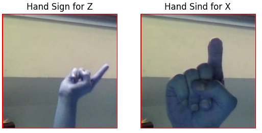
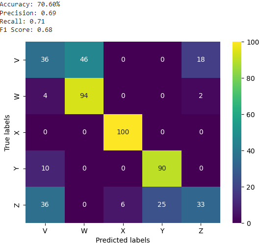
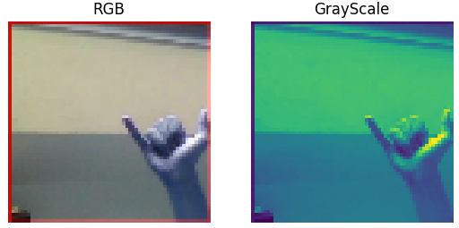
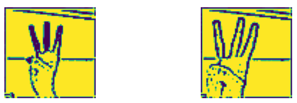
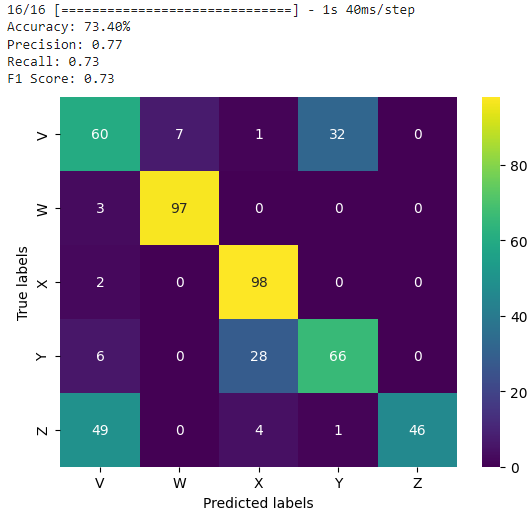
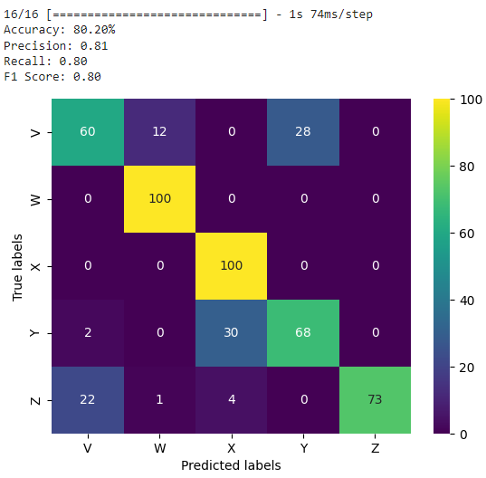

# ASL - American Sign Language Classification
 - Im working on classification of 5 signs: 'V', 'Y', 'X', 'Y', 'Z'. Initially dataset pictures look like this:

- Pictures are RGB and 200*200 in size.

If I just make and train a classification model I get accuracy around 70%(Pictures are already augmented).

- Before filtering, datasets are resized to 64*64 and loaded as 1 channel images(grayscale).

## Filtering Sections

Next I experimented with different digital image preprocessing techniques, in most cases order of filters is:
- 

  

- Next I created model and fited it again and again with differenty preprocesed dataset

- After some time I couldnt raise accuracy any more, with 2 median and one addaptive gaussian filter I found accuracy of 81% on test set

