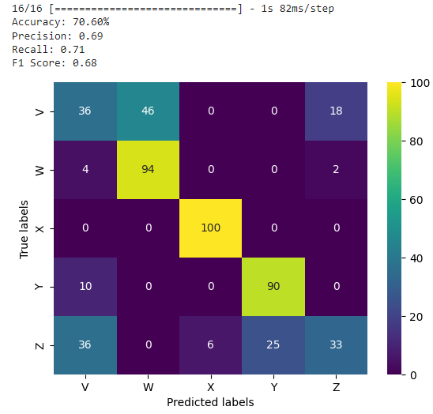
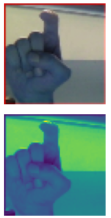
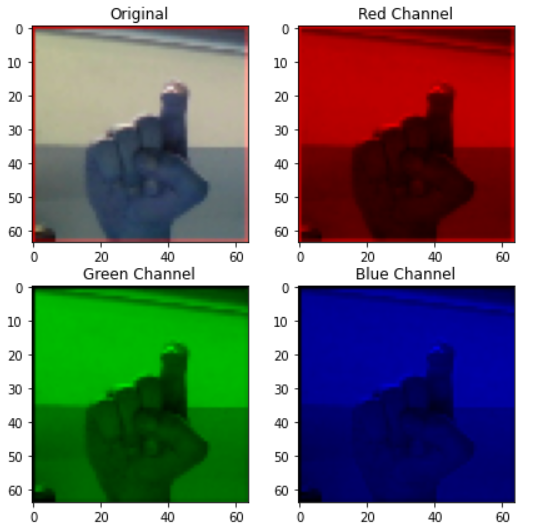
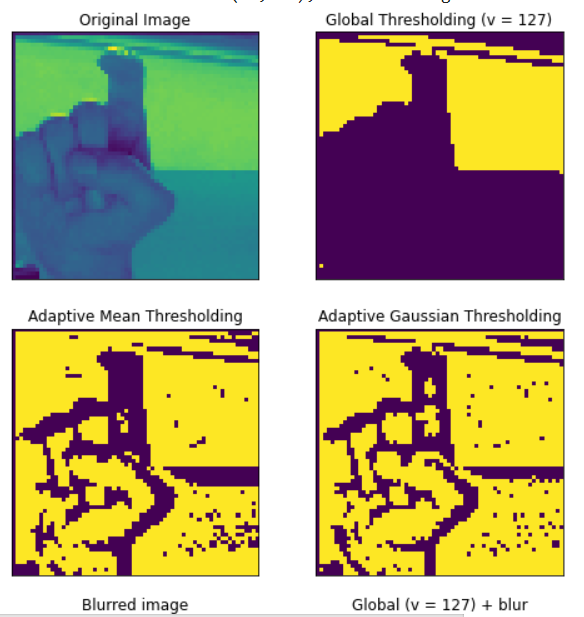
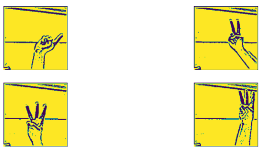
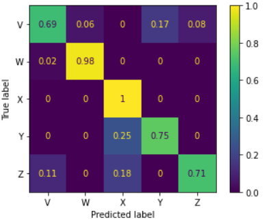

# ASL - American Sign Language
Neural_Networks_Digital_Image_Processing

## General
 - I have pictures of sign language, and after creating simple neural network model for classification we have accuracy about 70%

- Next I tried separating RGB channels from images hoping for better accuracy on some channel alone, but after building again my confusion matrix, I saw thats not the case

- Because of that, and because there is no difference in accuracy between 3D channel image and 2D channel image I proceded with 2D channel image preprocesing

- Next I experimented with different combinations of filters and try them to see if there is any improvement, and slowly there was a progress
  

- After some time I couldnt raise accuracy any more, with 2 median and one addaptive gaussian filters I found accuracy of 82%

