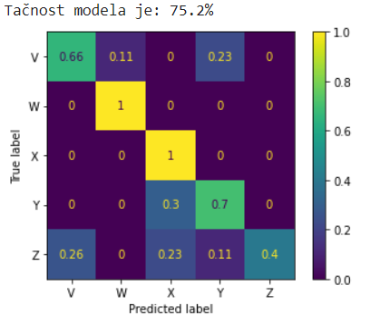

# ASL
Neural_Networks_Digital_Image_Processing

https://colab.research.google.com/drive/13KtkvlcsXIj1zDMWkQgRNqIbdmkGK5-D?usp=sharing

## General
 - We have pictures of sign language, and after creating simple neural network model for classification we have accuracy about 75%

